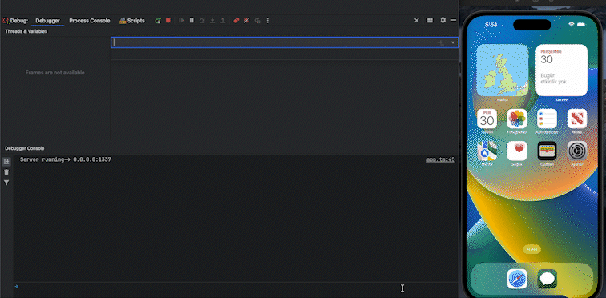

# Flutter gRPC Client Example

This project demonstrates how to create a [gRPC](https://grpc.io/ "gRPC") client in Flutter. The project uses the grpc package from pub.dev to create the client.

## Articles

- [What is gRPC?](https://salihcanbinboga.medium.com/grpc-nedir-1-1a9dcc525750 "What is gRPC?")
- [Create API with gRPC](https://salihcanbinboga.medium.com/typescript-ile-grpc-sunucu-olu%C5%9Fturmak-4ae21a394eab "Create API with gRPC")
- Flutter gRPC Client Integration



## Getting Started

To run the project, you will need to have Flutter and Dart installed on your machine. You can download the latest version of Flutter from the [official website](https://docs.flutter.dev/get-started/install "official website").

#### Installing Dependencies

After cloning the repository, you can install the required dependencies by running the following command:

```bash
flutter pub get
```

#### Running the Application

To run the application, you can use the following command:

```bash
flutter run
```

#### Generate RPC Classes

To generate RPC classes you can use the following command:

```bash
cd $PROJECT_ROOT
cd scripts
sh proto_generator.sh
```

## Contributing
Contributions are welcome! Please feel free to submit a pull request.

## License
This project is licensed under the MIT License. See the [LICENSE](https://github.com/SalihCanBinboga/grpc_client_flutter/blob/master/LICENSE "LICENSE") file for details.